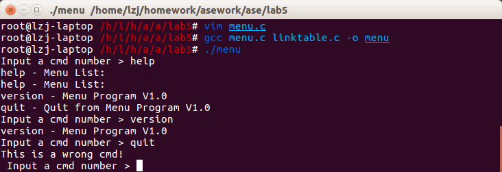
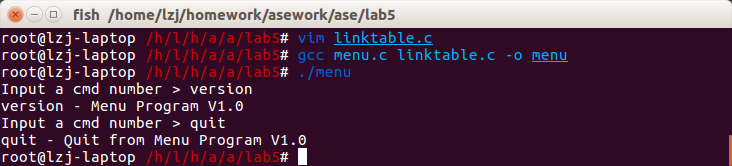
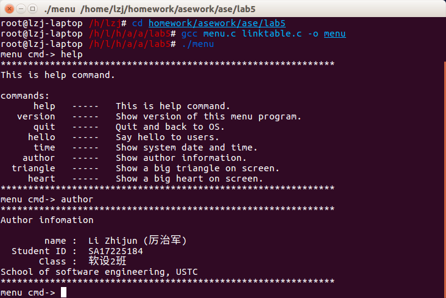
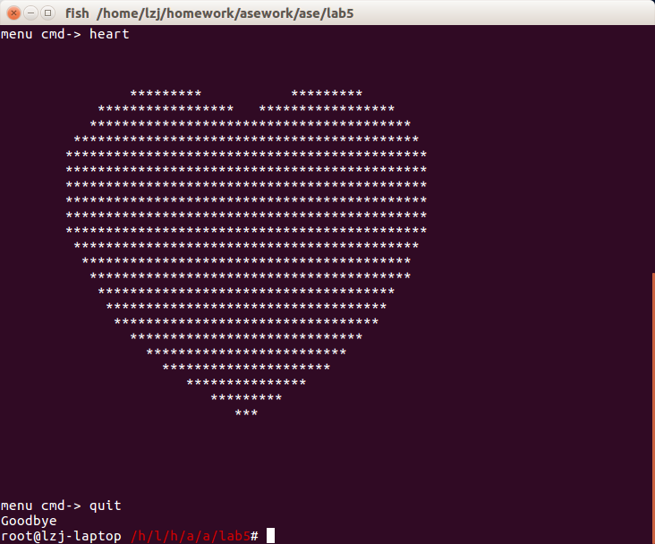

# 实验五：用callback增强链表模块来实现命令行菜单小程序V2.8
#### SA17225184 厉治军
## 目录
1. 实验要求
1. 实验过程
1. 实验结果
1. 实验心得  
## 1. 实验要求
- 新创建一个目录lab5完成实验。
- 然后将lab5-1.tar.gz中的代码（即解压后lab5.1/目录下的源文件）直接放到lab5/目录下继续完成后面的实验内容
- 本实验在提供的代码基础上进行
- 给lab5-1.tar.gz找bug，quit命令无法运行的bug
- 利用callback函数参数使Linktable的查询接口更加通用
- 注意接口的信息隐藏 

## 2. 实验过程
### 2.0 拉代码并创建实验文件夹

``` shell
cd /home/lzj/homework/asework
git clone git@github.com:lzjustc/ase.git
cd ase
mkdir lab5
```


### 2.1 找quit命令无法运行的BUG 
#### 2.1.1. 解压实验文件

``` shell
cd lab5
tar -zxf /home/lzj/share/lab5-1.tar.gz
mv lab5.1/* .
rm -rf lab5.1
```

#### 2.1.2 编译代码并Debug
`gcc menu.c linktable.c -o menu`  
`warning: implicit declaration of function 'strcmp'`  
发现是缺少包含头文件`<string.h>`， 在menu.c中加入`#include<string.h>`后消除。  
运行程序如图可以发现输入quit命令无法正常退出。  
  
查看代码，发现`linktable.c`中的`SearchLinkTableNode`函数存在问题。  
`while(pNode != pLinkTable ->pTail)`使得函数在找到链表最后一个节点时即退出循环,因此无法访问最后一个节点。  
将`while(pNode != pLinkTable -> pTail)`改为`while(pNode != NULL)`即可，如图所示。  
  
### 2.2 利用callback函数参数使Linktable的查询接口更加通用  
#### 2.2.1 准备工作
将2.1改错实验的文件打包入`lab5/lab5.1`，将lab4的实验文件copy到lab5，以此为基础进行修改。
`
``` shell
mkdir lab5.1
mv * lab5.1
cp ../lab4/*.c ../lab4/*.h .
```
#### 2.2.2 `linktable.h`代码如下
``` c++
#ifndef _LINK_TABLE_H_
#define _LINK_TABLE_H_

#define SUCCESS 0
#define FAILURE (-1)

typedef struct LinkTableNode
{
    struct LinkTableNode* pNext;
}tLinkTableNode;

typedef struct LinkTable
{
    tLinkTableNode *pHead;
    tLinkTableNode *pTail;
    int             sumOfNode;
}tLinkTable;

tLinkTable* CreateLinkTable();

int DeleteLinkTable(tLinkTable* pLinkTable);

int AddLinkTableNode(tLinkTable* pLinkTable, tLinkTableNode* pNode);

int DelLinkTableNode(tLinkTable* pLinkTable, tLinkTableNode* pNode);


tLinkTableNode * SearchLinkTableNode(tLinkTable *pLinkTable, int Conditon(tLinkTableNode * pNode));

tLinkTableNode* GetLinkTableHead(tLinkTable* pLinkTable);

tLinkTableNode * GetNextLinkTableNode(tLinkTable *pLinkTable,tLinkTableNode * pNode);

#endif /* _LINK_TABLE_H_ */
```
#### 2.2.3 `linktable.c`代码如下
``` c++
#include <stdio.h>
#include <stdlib.h>
#include "linktable.h"

tLinkTable* CreateLinkTable()
{
    tLinkTable* pLinkTable = (tLinkTable*)malloc(sizeof(tLinkTable));
    if(pLinkTable == NULL)
    {
        return NULL;
    }
    pLinkTable->pHead = NULL;
    pLinkTable->pTail = NULL;
    pLinkTable->sumOfNode = 0;
    return pLinkTable;
}

int DeleteLinkTable(tLinkTable* pLinkTable)
{
    if(pLinkTable == NULL)
    {
        return FAILURE;
    }
    while(pLinkTable->pHead != NULL)
    {
        tLinkTableNode* pNode = pLinkTable->pHead;
        pLinkTable->pHead = pLinkTable->pHead->pNext;
        free(pNode);  
    } 
    pLinkTable->pHead = NULL;
    pLinkTable->pTail = NULL;
    pLinkTable->sumOfNode = -1;
    free(pLinkTable);
    return SUCCESS;
}

int AddLinkTableNode(tLinkTable* pLinkTable, tLinkTableNode* pNode)
{
    if (pLinkTable == NULL || pNode == NULL)
    {
        return FAILURE;
    }
    pNode->pNext = NULL;
    if (pLinkTable->pHead == NULL)
    {
        pLinkTable->pHead = pNode;
    }
    if (pLinkTable->pTail == NULL)
    {
        pLinkTable->pTail = pNode;
    }
    else
    {
        pLinkTable->pTail->pNext = pNode;
        pLinkTable->pTail = pNode;
    }
    pLinkTable->sumOfNode = pLinkTable->sumOfNode + 1;
    return SUCCESS;
}

int DelLinkTableNode(tLinkTable* pLinkTable, tLinkTableNode* pNode)
{
    if (pLinkTable == NULL || pNode == NULL)
    {
        return FAILURE;
    }
    if (pLinkTable->pHead == pNode)
    {
        pLinkTable->pHead = pLinkTable->pHead->pNext;
        pLinkTable->sumOfNode = pLinkTable->sumOfNode - 1;
        if (pLinkTable->sumOfNode == 0)
        {
            pLinkTable->pTail == NULL;
        }
        return SUCCESS;
    }
    tLinkTableNode* p = pLinkTable->pHead;
    while (p != NULL)
    {
        if (p->pNext == pNode)
        {
            p->pNext = p->pNext->pNext;
            pLinkTable->sumOfNode = pLinkTable->sumOfNode - 1;
            if (pLinkTable->sumOfNode == 0)
            {
                pLinkTable->pTail = NULL;
            }
            return SUCCESS;
        }
        p = p->pNext;
    }
    return FAILURE;
}

tLinkTableNode * SearchLinkTableNode(tLinkTable *pLinkTable, int Conditon(tLinkTableNode * pNode))
{
    if(pLinkTable == NULL || Conditon == NULL)
    {
        return NULL;
    }
    tLinkTableNode * pNode = pLinkTable->pHead;
    while(pNode != NULL)
    {    
        if(Conditon(pNode) == SUCCESS)
        {
            return pNode;				    
        }
        pNode = pNode->pNext;
    }
    return NULL;
}

tLinkTableNode* GetLinkTableHead(tLinkTable* pLinkTable)
{
    if (pLinkTable == NULL || pLinkTable->pHead == NULL)
    {
        return NULL;
    }
    return pLinkTable->pHead;
}

tLinkTableNode * GetNextLinkTableNode(tLinkTable *pLinkTable,tLinkTableNode * pNode)
{
    if (pLinkTable == NULL || pNode == NULL)
    {
        return NULL;
    }
    tLinkTableNode* pTempNode = pLinkTable->pHead;
    while (pTempNode != NULL)
    {
        if (pTempNode == pNode)
        {
            return pTempNode->pNext;
        }
        pTempNode = pTempNode->pNext;
    }
    return NULL;
}
```
#### 2.2.4 `menu.c`代码如下
``` c++
#include <stdio.h>
#include <stdlib.h>
#include <string.h>
#include "linktable.h"

void Help();
void Version();
void Quit();
void Hello();
void Time();
void Author();
void Triangle();
void Heart();

#define CMD_MAX_LEN 128
#define DESC_LEN    1024
#define CMD_NUM     10

char cmd[CMD_MAX_LEN]; 

typedef struct DataNode
{
    tLinkTableNode* pNext;
    char* cmd;
    char* desc;
    void (*handler)();
}tDataNode;

int SearchCondition(tLinkTableNode * pLinkTableNode)
{
    tDataNode * pNode = (tDataNode *)pLinkTableNode;
    if(strcmp(pNode->cmd, cmd) == 0)
    {
        return  SUCCESS;  
    }
    return FAILURE;	       
}

tDataNode* FindCmd(tLinkTable* head, char* cmd)
{
    return  (tDataNode*)SearchLinkTableNode(head,SearchCondition);
}

int ShowAllCmd(tLinkTable* head)
{
    tDataNode* pNode = (tDataNode*) GetLinkTableHead(head);
    while(pNode != NULL)
    {
        printf("%10s   -----   %s\n", pNode->cmd, pNode->desc);
        pNode = (tDataNode*)GetNextLinkTableNode(head, (tLinkTableNode*)pNode);
    }
    return 0;
}

typedef struct CMDNode
{
    char* cmd;
    char* desc;
    void (*handler)();
    struct CMDNode *next;
}tCMDNode;
    
tCMDNode Head[] =
{
    {"help", "This is help command.", Help, &Head[1]},
    {"version","Show version of this menu program.", Version, &Head[2]},
    {"quit", "Quit and back to OS.", Quit, &Head[3]},
    {"hello", "Say hello to users.", Hello, &Head[4]},
    {"time", "Show system date and time.", Time, &Head[5]},
    {"author", "Show author information.", Author, &Head[6]},
    {"triangle", "Show a big triangle on screen.", Triangle, &Head[7]},
    {"heart", "Show a big heart on screen.", Heart, NULL},
};

tLinkTable* InitMenuData(tCMDNode* Head, int length)
{
    tLinkTable* pLinkTable = CreateLinkTable();
    int i;
    for(i=0; pLinkTable->sumOfNode < length; i++)
    {
        tDataNode* pNode = (tDataNode*)malloc(sizeof(tDataNode));
        pNode->cmd = Head[i].cmd;
        pNode->desc = Head[i].desc;
        pNode->handler = Head[i].handler;
        AddLinkTableNode(pLinkTable, (tLinkTableNode*)pNode);
    }
    return pLinkTable;
}

int main()
{
	tLinkTable* head = InitMenuData(Head, 8); 
    while(1)
    {
        printf("menu cmd-> ");
        scanf("%s", cmd);
        tDataNode* p = FindCmd(head, cmd);      
        if(p == NULL)
        {
            printf("error: Wrong command!\n");
        }
        else
        {
            p->handler();
        }
    }
    return 0;
}

void Help()
{
    printf("*************************************************************\n");
    printf("This is help command.\n\n");
    printf("commands:\n");
	tLinkTable* head = InitMenuData(Head, 8); 
    ShowAllCmd(head);
    printf("*************************************************************\n");
}

void Version()
{
    printf("menu version v2.8\n");
}

void Quit()
{
    printf("Goodbye\n");
    exit(0);
}

void Hello()
{
    printf("Hi, How are you?\n");
    char answer;
    printf("Input (Y/N), Y:I'm fine, thank you!  N:I'm feeling terrible\n");
    getchar();
    answer = getchar();
    if(answer == 'Y' || answer == 'y')
    {
        printf("Wish you happy everyday!\n");
    }
    else if(answer == 'N' || answer == 'n')
    {
        printf("Cheer up, things will work out for the best!\n");
    }
    else
    {
        printf("Sorry, I can't understand it!\n");
    }
}

void Time()
{
    system("date");
}

void Author()
{
    printf("*************************************************************\n");
    printf("Author infomation\n\n");
    printf("%12s :  Li Zhijun (厉治军)\n", "name");
    printf("%12s :  SA17225184\n", "Student ID");
    printf("%12s :  软设2班\n", "Class");
    printf("School of software engineering, USTC\n");
    printf("*************************************************************\n");
}

void Triangle()
{
    int i,j;
    int n = 20;
    for(i = 0; i < n; i++)
    {
        for(j = n - i + 10; j > 0; j--)
        {
            putchar(' ');
        }
        for(j = 0; j < i * 2 - 1; j++)
        {
            putchar('*');
        }
        putchar('\n');
    }
}

void Heart()
{
    float x, y;
    for(y = 1.5f; y > -1.5f; y -= 0.1f)
    {
        for(x = -1.5f; x < 1.5f; x += 0.05f)
        {
            float a = x * x + y * y - 1;
            putchar(a * a * a - x * x * y * y * y <= 0.0f ? '*': ' ');
        }
        putchar('\n');
    }
}
```
### 3 实验结果
  
  

### 4 实验心得
- 回调函数就是一个通过函数指针调用的函数。如果你把函数的指针（地址）作为参数传递给另一个函数，当这个指针被用来调用其所指向的函数时，我们就说这是回调函数。回调函数不是由该函数的实现方直接调用，而是在特定的事件或条件发生时由另外的一方调用的，用于对该事件或条件进行响应。
- 因为可以把调用者与被调用者分开，所以调用者不关心谁是被调用者。它只需知道存在一个具有特定原型和限制条件的被调用函数。简而言之，回调函数就是允许用户把需要调用的方法的指针作为参数传递给一个函数，以便该函数在处理相似事件的时候可以灵活的使用不同的方法。
- callback函数的使用提高了代码的重用性，实现了更松的耦合。同时将一些内部结构接口隐藏，简化了用户接口，更保证了使用安全，减少误操作。